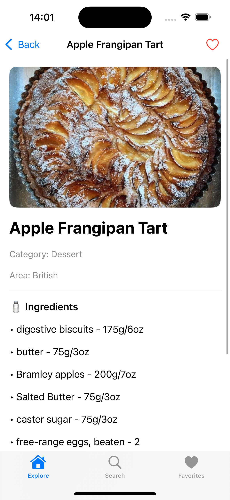
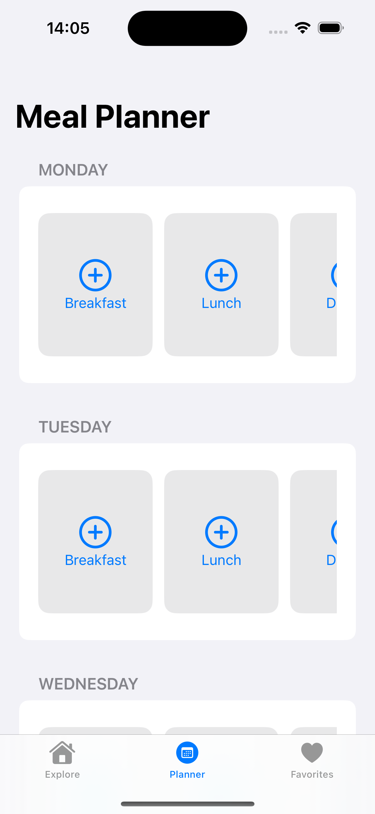
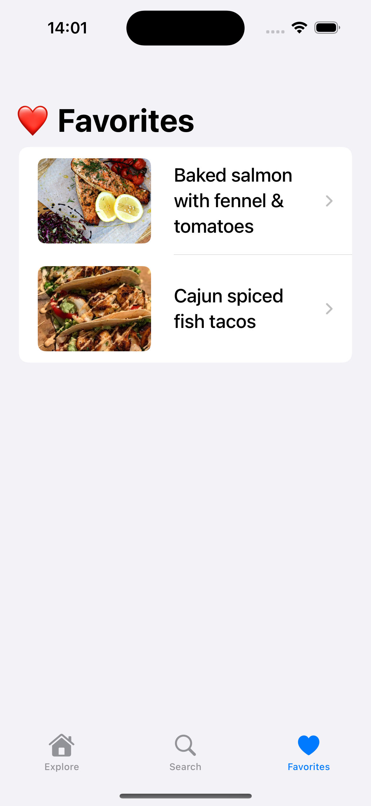

# Appetizers App

A **SwiftUI-based iOS application** that allows users to browse a list of appetizers pulled from an API, view details for each item, and add them to an order. The app emphasizes clean architecture, **MVVM**, networking with **async/await**, and SwiftUI state management.

## Features

- Browse a list of meals
- Pull data asynchronously from a remote API
- View meal details, descriptions, and add to favorites
- Create a daily meal plan schedule

## Tech Stack

- Swift
- SwiftUI
- MVVM architecture
- Async/Await networking

## Screenshots

  

    
Explore

    
  

  

    
Meal

    
  

  

    
Planner

    
  

  

    
Favorites

    
  

